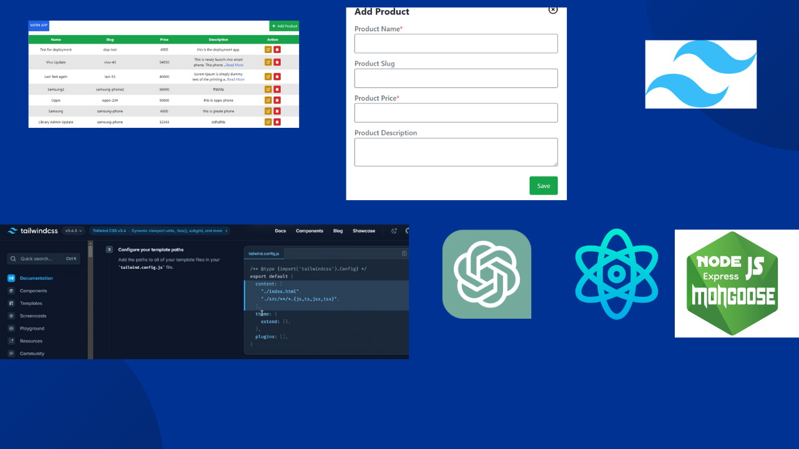

# MERN CRUD APP


This is a MERN Crud application with lots of features like creating and updating modal UI, validation, read more and less, finally deploy for free.

You can change the live server url to local in config.js
server url -> localhost:4000


## Installation


```bash
  git clone or fetch
   
  cd my-project
  npm Install

  cd clinet
  npm Install

  root directory
  npm run dev

```
    
## Acknowledgements

  Make sure setup your mongoDB database then past the user credentials in .env




## 🚀 About Me
I'm a full stack developer...


## Feedback

If you have any feedback, please reach out to us at 
missionaryzeal12@gmail.com

